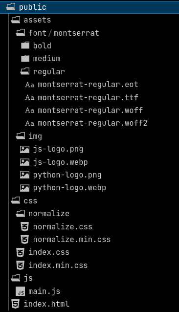

# Minesweeper

### Description
  Classic game — [Minesweeper](https://en.wikipedia.org/wiki/Minesweeper_(video_game))
  
  Assembly file structure:
  
  

### Usage
  - Development mode - `npm start`
  - Build mode - `npm run build`

### links
  - [Technical task](https://github.com/rolling-scopes-school/tasks/blob/master/tasks/minesweeper/README.md)
  - [An example of working with canvas based on a game called life](https://www.youtube.com/watch?v=OayZHKZvcsg)
  - [Mines example game](https://packages.debian.org/search?keywords=gnome-mines)
  - [Basic tutorial for this build](https://www.youtube.com/watch?v=qSZvGlIKGPg&list=PL0xWjA6ceuAx_LTUOJ20WUBwK_UUUwics&index=21&t=1428s)
  - [Architecting a CSS project](https://sass-guidelin.es/#architecture)